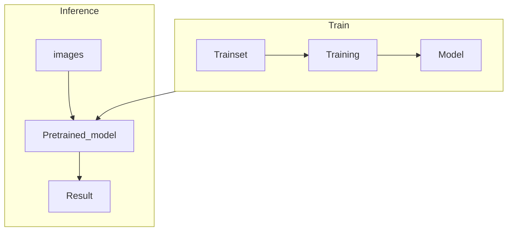

# Overview
  
  <h1 align="center">U<sup>2</sup>-Net: U Square Net</h1>

이 문서는 NIPA 프로젝트를 위해 논문 **U<sup>2</sup>-Net(U square net)** 의 official code를 수정하여 이미지에서 특정 오브젝트의 Mask Segmentation을 하기 위해 만들었습니다.

#### [U<sup>2</sup>-Net: Going Deeper with Nested U-Structure for Salient Object Detection](https://arxiv.org/pdf/2005.09007.pdf)

---


## Process

## Directories
```plaintext
└── U-2-Net
    ├── model
    │    ├── u2net_refactor.py
    │    └── u2net.py
    ├── result
    │    ├── product1
    │    ├── product2
    │    ├── ...
    │    └── productN
    ├── sample
    │    ├── product1
    │    └── product2
    ├── saved_models
    │    ├── u2net.pth (173.6MB weights file)
    │    └── u2netp.pth (4.7MB weights file)
    ├── data_loader.py 
    ├── setup_model_weights.py 
    ├── train_diabetes.py
    ├── U2N_inference.py
    ├── u2net_train.py
    ├── u2net_test.py
    └── requirements.txt
```


