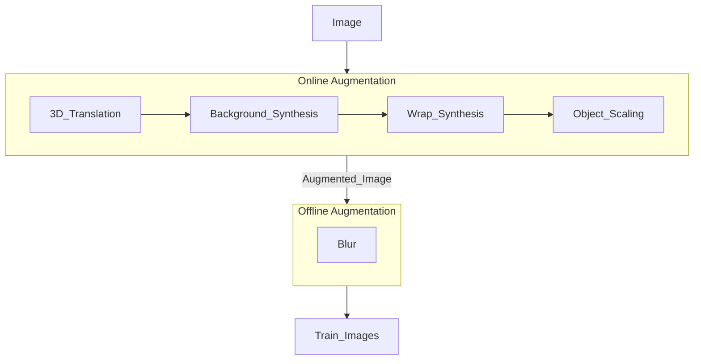

# Overview

```mermaid
flowchart TB
    Image --> Online_Augmentation
    Online_Augmentation--"Augmented_Image"--> Offline_Augmentation
    Offline_Augmentation--> Train_Images
    subgraph Online_Augmentation["Online Augmentation"]
        3D_Translation-->Background_Synthesis-->Wrap_Synthesis--> Object_Scaling
    end
    subgraph Offline_Augmentation["Offline Augmentation"]
        Blur
    end
```

## Process
